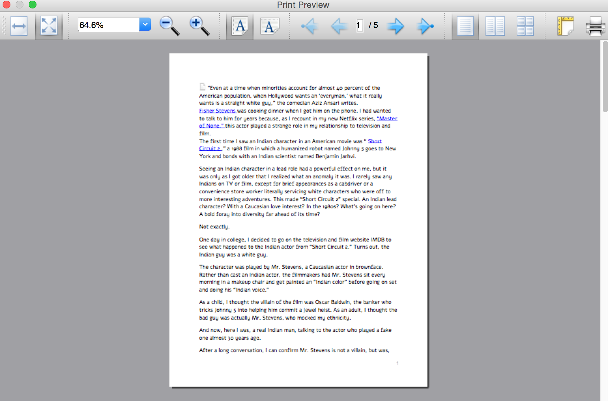

I like NPR, so I made some scripts to download my favorite programs from
NPR. For now, I have something that downloads [Fresh
Air](http://www.npr.org/programs/fresh-air/), [Wait Wait..Don’t Tell
Me](http://www.npr.org/programs/wait-wait-dont-tell-me/), and [This
American Life](http://www.thisamericanlife.org/). This package can
probably, straightforwardly be extended to other NPR and PRI programs.

Although this project started off as a way to download these three
programs, I have expanded it to include a grab bag of altogether
different types of functionalities. What remains the same? This
distribution consists mainly of executable python scripts.

I organize this document into the following sections: [Core Functionality](#core-functionality), [New Functionality](#new-functionality), [Graphics Functionality](#graphics-functionality) (in folders
`gui` and `gui2`), and a small section called [Oldstuff](#oldstuff)
.

This document was converted from a LaTeX source using
[Pandoc](http://pandoc.org/index.html), via
```bash
    pandoc -s README.tex -o README.md
```
## Core Functionality <a name="core-functionality"></a>

This consists of functionality to grab episodes from [Fresh
Air](http://www.npr.org/programs/fresh-air/), [Wait Wait..Don’t Tell
Me](http://www.npr.org/programs/wait-wait-dont-tell-me/), and [This
American Life](http://www.thisamericanlife.org/). These consist of the
following pieces of python code:

-   `npr_utils.py` contains common utilities to get the
    proper metadata for NPR programs, to name these media files in the
    proper date format, and to get the full paths to the
    [LibAV/FFMPEG](https://libav.org) and
    [HandBrakeCLI](https://handbrake.fr/) tools to create the NPR
    programs in m4a and mp3 formats (among other functionalities).

-   These four files handle NPR Fresh Air downloads:
    `freshair.py`, `freshair_crontab.py`,
    `freshair_fix_crontab.py`, and
    `freshair_by_year.py`.

    -   `freshair.py` is the main executable that downloads
        NPR Fresh Air episodes, converts them to m4a format, and then
        applies correct metadata. The help screen for this command line
        tool is here,
        ```bash
            Usage: freshair.py [options]

            Options:
              -h, --help         show this help message and exit.
              --dirname=DIRNAME  Name of the directory to store the file. Default is /mnt/media/freshair.
              --date=DATE        The date, in the form of "January 1, 2014." The default is todays date, November 14, 2015.
              --debug            If chosen, run freshair.py in debug mode. Useful for debugging :)
        ```

    -   `freshair_crontab.py` downloads an NPR Fresh Air
        episode on a given weekday. It should be called by a cron job
        that should be run every weekday.

    -   `freshair_fix_crontab.py` tries to re-download NPR
        Fresh Air episodes that may be incomplete – defined as shorter
        than 30 minutes – and which are 90 days or older. This
        executable searches through the library of all NPR Fresh Air
        episodes, and tries to re-download older, possibly
        incomplete episodes.

    -   `freshair_by_year.py` downloads all the NPR Fresh
        Air episodes in a given year.

-   These four files handle NPR Wait Wait downloads:
    `waitwait.py`, `waitwait_realmedia.py`,
    `waitwait_crontab.py`, and
    `waitwait_by_year.py`.

    -   `waitwaiy.py` is the main executable that downloads NPR Wait Wait episodes, converts them to m4a format, and then applies correct metadata. `waitwait_realmedia.py` is a python module that allows one to download NPR Wait Wait episodes older than 2004, which are in [RealMedia](https://en.wikipedia.org/wiki/RealMedia) format. The help screen for this command line tool is here,
    ```bash
            Usage: waitwait.py [options]

            Options:
              -h, --help         show this help message and exit.
              --dirname=DIRNAME  Name of the directory to store the file. Default is /mnt/media/waitwait.
              --date=DATE        The date, in the form of "January 1, 2014." The default is last Saturday, November 14, 2015.
              --debugonly        If chosen, download the NPR XML data sheet for this Wait Wait episode.
    ```

    -   `waitwait_crontab.py` downloads an NPR Wait Wait episode on a given Saturday. It should be called by a cron job that should be run every Saturday.

    -   `waitwait_by_year.py` downloads all the NPR Wait Wait episodes in a given year.

-   `thisamericanlife.py` *manually* downloads a given episode number of This American Life. This executable uses a custom online archive for older This American Life episodes that *used to be* described [here](http://www.dirtygreek.org/t/download-this-american-life-episodes) (it no longer exists). The help screen for this command line tool is here,
    ```bash
      Usage: thisamericanlife.py [options]

      Options:
        -h, --help            show this help message and exit.

        --episode=EPISODE     Episode number of This American Life to download.
                        Default is 150.
        --directory=DIRECTORY Directory into which to download This American Life episodes. Default is /mnt/media/thisamericanlife.
        --extra=EXTRASTUFF    If defined, some extra stuff in the URL to get a This American Life episode.
        --noverify            If chosen, then do not verify the SSL connection.
        --debug               If chosen, just download the TAL episode into a file into the specified directory.
    ```

## New Functionality <a name="new-functionality"></a>

This consists of newer functionality that does not download NPR
episodes, nor can one straightforwardly modify them to download NPR
episodes. These consist of the following pieces of python code.

-   `autoCropImage.py` automatically crops image (png,
    jpeg, tiff, pdf, etc.) files to remove whitespace. The default whitespace
    color is `white`. The help screen for this command line
    tool is here,
    ```bash
        Usage: autoCropImage.py [options]

        Options:
          -h, --help       show this help message and exit
          --input=INPUT    Name of the input file.
          --output=OUTPUT  Name of the output file. Optional.
          --color=COLOR    Name of the color over which to autocrop. Default is white.
    ```

-   `convertImage.py` uses the [CloudConvert REST
    API](https://cloudconvert.com/apiconsole) to *smoothly and without pain points* convert and resize SVG images to PNG images of the same base name. The help screen for this command line tool is here,
    ```bash
        Usage: convertImage.py [options]

        Options:
          -h, --help           show this help message and exit
          --filename=FILENAME  Name of the input SVG file.
          --width=WIDTH        If defined, new width of the file. Optional
    ```

-   `changedates.py` changes the creation date of JPG and
    MOV files, that my Canon digital camera creates, by up and down
    one year. I created this tool because my Canon digital camera does
    not set the right year on the creation date for image files
    it creates. This caused problems when I uploaded those images to
    [Google Picasa](https://picasaweb.google.com/home) or
    [Google+](https://plus.google.com/). The help screen for this
    command line tool is here,
    ```bash
        Usage: changedates.py [options]

        Options:
          -h, --help         show this help message and exit
          --dirname=DIRNAME  Name of the directory to look for jpeg files.
          --movs             If chosen, process MOV files instead.
          --minus            If chosen, subtract a year from the files.
    ```

-   `music_to_m4a.py` can convert a single file from
    mp3/ogg/flac format to m4a format while preserving music file
    metadata, and can optionally set the total number of album tracks
    and the album cover if the music files is in an album. It can also
    rename an m4a music file into the format “*artist name* - *song
    name*.m4a.” The help screen for this command line tool is here,
    ```bash
        Usage: music_to_m4a.py [options]

        Options:
          -h, --help            show this help message and exit
          --inputfile=INPUTFILE
                                Name of the input audio file to convert.
          --outfile=OUTFILE     Optional name of the output file.
          --tottracks=TOTTRACKS
                                Optional total number of tracks in album of which song
                                is a part.
          --albumloc=ALBUMLOC   Optional path to location of the album cover image
                                file. Must be in JPEG or PNG.
          --quiet               If chosen, then verbosely print output of processing.
          --rename              If chosen, simply rename the m4a file to the form
                                <artist>.<song title>.m4a
    ```

-   `download_surahs.py` downloads recorded surahs
    ([Abdur-Rashid Sufi](http://quranicaudio.com/quran/109)) to a
    directory of your choice. The help screen for this command line tool
    is here,
    ```bash
        Usage: download_surahs.py [options]

        Options:
          -h, --help       show this help message and exit
          --outdir=OUTDIR  Directory to put this data into. Default is
                           /mnt/software/sources/pythonics/nprstuff.
    ```

-   `display.py`  displays an image (SVG, PNG, JPEG, GIF) using the default image viewer for your operating system ([Preview](https://en.wikipedia.org/wiki/Preview_(macOS)) for Mac OS X, [ImageMagick]() for Linux, etc.) Its command is simple,
    ```bash
    display.py <imagefile>.
    ```

-   `imageFromURL.py` saves PNG images from an URL to disk. The help
    screen for this command line tool is here,
    ```bash
    Usage: imageFromURL.py [options]

    Options:
      -h, --help           show this help message and exit
      --url=URL            URL where the image is located.
      --filename=FILENAME  The name of the PNG file to save the online image. The
                       image name must end in .png. The default name is
                       default.png.
      ```
r
## Graphics Functionality <a name="graphics-functionality"></a>

This section describes the two graphical tools I have developed:
`gui` matches a small subset of functionality that the
[Readability](https://www.readability.com) tool handles excellently;
`gui2` is a
[PyQt4](https://www.riverbankcomputing.com/software/pyqt/download) GUI
front-end to the [Readability](https://www.readability.com) API.

UPDATE: if any of you have gone to the Readability website, you may have realized that Readability has been defunct for [over 2 years now](https://medium.com/@readability/the-readability-bookmarking-service-will-shut-down-on-september-30-2016-1641cc18e02b).

### GUI: Media Website Text Formatter <a name="gui1"></a>

This GUI can read from the following media websites: [Lightspeed
Magazine](http://www.lightspeedmagazine.com/),
[Medium](https://medium.com/), [The New
Yorker](http://www.newyorker.com/), [The New York
Times](http://www.nytimes.com/?WT.z_jog=1), and the [Virginia Quarterly
Review](http://www.vqronline.org/). Here is a screenshot!

|        |
| :----- |
|  |
| screenshot of the GUI reader, converting the URL for the [The New York Times](http://www.nytimes.com) into text. Note the separate icons above for the five media websites from which this GUI can read. |

The screenshots of the save file dialog and the print preview dialog are
shown here.

|        |        |
| :----- | :----- |
|  |  |
| The GUI screenshot of the save dialog. | The GUI screenshot of the print preview dialog. |

Note, here I do not support or maintain this tool after I found out about [Readability](https://www.readability.com).

### GUI2: Readability GUI Front-End <a name="gui2"></a>

This is the PyQt4 GUI front-end to [Readability](https://www.readability.com).

|        |        |
| :----- | :----- |
|  |  |
| The list form of the article’s content, with working dialogs for `Font` and `Print Preview`. | The text form of the article’s content, with working dialogs for `Font` and `Print Preview`. |

A screen shot of the font changing dialog, the `Font` button, and a screenshot of the print preview dialog, the `Print` button, are shown below.

|        |        |
| :----- | :----- |
|  |  |
| The `Font` button dialog. | The print preview dialog launched by the `Print` button in the article text widget. |

In the future, I plan on at least implementing the following,
all using the Readability API.

-   `EPUB` button, to create the article in
    [EPUB](https://en.wikipedia.org/wiki/EPUB) format.

-   Adding and deleting articles through the article list widget.

## Oldstuff <a name="oldstuff"></a>

These are tools that I do not maintain, located in the
[oldstuff](https://github.com/tanimislam/nprstuff/blob/master/oldstuff) folder, but which others may find useful. These
are pieces of code that I have started, but which are unmaintained.
These are the following pieces of code: [freshair.sh](https://github.com/tanimislam/nprstuff/blob/master/oldstuff/freshair.sh),
[waitwait.sh](https://github.com/tanimislam/nprstuff/blob/master/oldstuff/waitwait.sh), and [google_pull_contacts.py](https://github.com/tanimislam/nprstuff/blob/master/oldstuff/google_pull_contacts.py).
