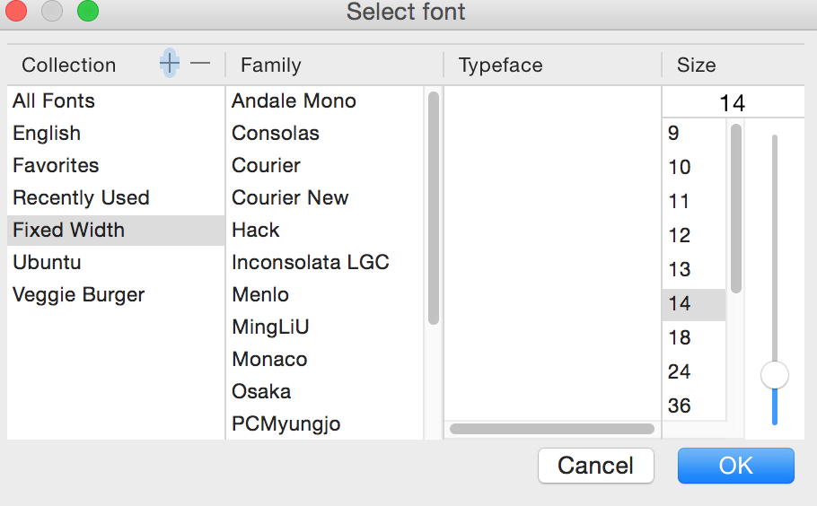

.. image:: https://badges.gitter.im/nprstuff-tanimislam/Lobby.svg
   :target: https://gitter.im/nprstuff-tanimislam/Lobby?utm_source=badge&utm_medium=badge&utm_campaign=pr-badge&utm_content=body_badge

###################################################################
Nprstuff - Utility Functionality for NPR Programs and Other Things
###################################################################
I like NPR, so I made some scripts to download my favorite programs from NPR. For now, I have something that downloads `NPR Fresh Air`_, `Wait Wait...Don't Tell
Me <waitwait_>`_, and `This American Life`_. This package can probably, straightforwardly be extended to other NPR and PRI programs (although I haven't yet done so).

Although this project started off as a way to download these three programs, I have expanded it to include a grab bag of altogether different types of functionalities. What remains the same? This distribution consists mainly of executable Python scripts. Detailed documentation lives in the Sphinx repository

NPR changed their API, which means that old functionality does not work. NPR has discontinued the `older NPR API`_, that powers much of this repository's functionality. I quote,

  This API is no longer publicly available for client integrations; for documentation of current API services, please visit the NPR Developer Center.

Furthermore, the newer `NPR One API`_ does not appear to have the necessary functionality to make my magic happen. The rest of the functionality lives in the

The comprehensive documentation lives in HTML created with `Sphinx <https://www.sphinx-doc.org/en/master/>`_, and now in the `Read the Docs <nprstuff_>`_ page for this project. To generate the documentation, go to the ``docs`` subdirectory. In that directory, run ``make html``. Load ``docs/build/html/index.html`` into a browser to see the documentation.

Core Functionality
^^^^^^^^^^^^^^^^^^^

This consists of functionality to grab episodes from `Fresh Air`_, `Wait Wait..Don't Tell Me <waitwait_>`_, and `This American Life`_. These consist of
the following pieces of python code:

* ``npr_utils.py`` contains common utilities to get the proper metadata for NPR programs, to name these media files in the proper date format, and to get the full paths to the LibAV_ or FFMPEG_ and HandBrakeCLI_ tools used to create the NPR programs in M4A_ and MP3_ formats (among other functionalities).

* These four executables handle `NPR Fresh Air`_ downloads: ``freshair``, ``freshair_crontab``, ``freshair_fix_crontab``, and ``freshair_by_year``.
  
  * ``freshair`` is the main executable that downloads `NPR Fresh Air`_ episodes, converts them to M4A_ format, and then applies correct metadata. The help screen for this command line tool is here,
    
    .. code-block::  console

       usage: freshair [-h] [--dirname DIRNAME] [--date DATE] [--mp3exist] [--debug]

       optional arguments:
	 -h, --help         show this help message and exit
	 --dirname DIRNAME  Name of the directory to store the file. Default is /mnt/media/freshair.
	 --date DATE        The date, in the form of "January 1, 2014." The default is today's date, August 11, 2020.
	 --mp3exist         If chosen, then do not download the transitional mp3 files. Use the ones that already exist.
	 --debug            If chosen, run freshair.py in debug mode. Useful for debugging :)

  * ``freshair_crontab`` downloads an `NPR Fresh Air`_ episode on a given weekday. It should be called by a cron job or a systemd service that runs every weekday.
    
  * ``freshair_fix_crontab`` tries to re-download `NPR Fresh Air`_ episodes that may be incomplete – defined as shorter than 30 minutes – and which are 90 days or older. This executable searches through the library of all NPR Fresh Air episodes, and tries to re-download older, possibly incomplete episodes.
  
  * ``freshair_by_year`` downloads all the NPR Fresh Air episodes in a given year. The help screen for this command line tool is here,

    .. code-block:: console

       usage: freshair_by_year [-h] [--year YEAR] [--inputdir INPUTDIR] [--quiet] [--coverage] [--audit]

       optional arguments:
	 -h, --help           show this help message and exit
	 --year YEAR          Year in which to write out all Fresh Air episodes. Default is 2020.
	 --inputdir INPUTDIR  Directory into which to store the NPR Fresh Air episodes. Default is /mnt/media/freshair.
	 --quiet              If chosen, do not print verbose output from the action of this script. By default this is false.
	 --coverage           If chosen, just give the list of missing Fresh Air episodes and nothing else.
	 --audit              If chosen, do the audit picture here.
    
* These four executables handle `NPR Wait Wait <waitwait_>`_ downloads: ``waitwait``, ``waitwait_realmedia``, ``waitwait_crontab``, and ``waitwait_by_year``.

  * ``waitwait`` is the main executable that downloads NPR Wait Wait episodes, converts them to M4A_ format, and then applies correct metadata. ``waitwait_realmedia.py`` is a Python module that allows one to download `NPR Wait Wait <waitwait_>`_ episodes older than 2004, which are in RealMedia_ format. The help screen for this command line tool is here,

    .. code-block:: console

       usage: waitwait [-h] [--dirname DIRNAME] [--date DATE] [--debugonly] [--noverify] [--justfix]

       optional arguments:
	 -h, --help         show this help message and exit
	 --dirname DIRNAME  Name of the directory to store the file. Default is /mnt/media/waitwait.
	 --date DATE        The date, in the form of "January 1, 2014." The default is last Saturday, August 08, 2020.
	 --debugonly        If chosen, download the NPR XML data sheet for this Wait Wait episode.
	 --noverify         If chosen, Do not verify the SSL connection.
	 --justfix          If chosen, just fix the title of an existing NPR Wait Wait episode's file.

  * ``waitwait_crontab`` downloads an NPR Wait Wait episode on a given Saturday. It should be called by a cron job or systemd service that is run every Saturday.

  * ``waitwait_by_year`` downloads all the NPR Wait Wait episodes in a given year. The help screen for this command line tool is here,

    .. code-block:: console

       usage: waitwait_by_year [-h] [--year YEAR] [--inputdir INPUTDIR] [--quiet]

       optional arguments:
	 -h, --help           show this help message and exit
	 --year YEAR          Year in which to write out all Fresh Air episodes. Default is 2010.
	 --inputdir INPUTDIR  Directory into which to store the NPR Fresh Air episodes. Default is /mnt/media/waitwait.
	 --quiet              If chosen, do not print verbose output from the action of this script. By default this is false.

* ``thisamericanlife`` *manually* downloads a given episode number of `This American Life`_. The help screen for this command line tool is here,

  .. code-block:: console

     usage: thisamericanlife [-h] [--episode EPISODE] [--directory DIRECTORY] [--extra EXTRASTUFF] [--noverify] [--dump] [--info]

     optional arguments:
       -h, --help            show this help message and exit
       --episode EPISODE     Episode number of This American Life to download. Default is 150.
       --directory DIRECTORY
			     Directory into which to download This American Life episodes. Default is /mnt/media/thisamericanlife.
       --extra EXTRASTUFF    If defined, some extra stuff in the URL to get a This American Life episode.
       --noverify            If chosen, then do not verify the SSL connection.
       --dump                If chosen, just download the TAL episode XML into a file into the specified directory.
       --info                If chosen, then do INFO logging.

New Functionality
^^^^^^^^^^^^^^^^^^^

This consists of newer functionality that does not download NPR episodes, nor can one straightforwardly modify them to download NPR episodes. These consist of the following pieces of python code.

*  ``autoCropImage`` automatically crops image (PNG_, JPEG_, TIFF_, etc.) and PDF_ files to remove whitespace. The default whitespace color is ``white``. The help screen for this command line tool is here,

   .. code-block:: console

      usage: autoCropImage [-h] --input INPUT [--output OUTPUT] [--color COLOR] [--trans] [--newwidth NEWWIDTH] [--show]

      optional arguments:
	-h, --help           show this help message and exit
	--input INPUT        Name of the input file.
	--output OUTPUT      Name of the output file. Optional.
	--color COLOR        Name of the color over which to autocrop. Default is white.
	--trans              If chosen, also remove the transparency wrapping around the image. Works only for non-PDF images.
	--newwidth NEWWIDTH  New width of the image.
	--show               If chosen, then show the final image after cropped.

* ``convertImage`` uses the `CloudConvert REST API`_ to *smoothly and without pain points* convert and resize SVG_ images to PNG_ images of the same base name. The help screen for this command line tool is here,

   ::

       Usage: convertImage.py [options]

       Options:
         -h, --help           show this help message and exit
         --filename=FILENAME  Name of the input SVG file.
         --width=WIDTH        If defined, new width of the file. Optional

* ``changedates`` changes the creation date of JPEG_ and MOV_ files, that my Canon digital camera creates, by up and down one year. I created this tool because my Canon digital camera does not set the right year on the creation date for image files it creates. This caused problems when I uploaded those images to `Google Picasa <https://picasaweb.google.com/home>`__ or `Google+ <https://plus.google.com/>`__. The help screen for this command line tool is here,

  .. code-block:: console

     usage: changedates [-h] --dirname DIRNAME [--movs] [--minus]

     optional arguments:
       -h, --help         show this help message and exit
       --dirname DIRNAME  Name of the directory to look for jpeg files.
       --movs             If chosen, process MOV files instead.
       --minus            If chosen, subtract a year from the files.

* ``music_to_m4a`` can convert a single file from MP3_, OGG_, or FLAC_ format to M4A_ format while preserving music file metadata, and can optionally set the total number of album tracks and the album cover if the music files is in an album. It can also rename an m4a music file into the format “*artist name* - *song name*.m4a.” The help screen for this command line tool is here,

.. code-block:: console

   usage: music_to_m4a [-h] --inputfile INPUTFILE [--outfile OUTFILE] [--tottracks TOTTRACKS] [--albumloc ALBUMLOC] [--quiet] [--rename] [--notitle]

   optional arguments:
     -h, --help            show this help message and exit
     --inputfile INPUTFILE
			   Name of the input audio file to convert.
     --outfile OUTFILE     Optional name of the output file.
     --tottracks TOTTRACKS
			   Optional total number of tracks in album of which song is a part.
     --albumloc ALBUMLOC   Optional path to location of the album cover image file. Must be in JPEG or PNG.
     --quiet               If chosen, then verbosely print output of processing.
     --rename              If chosen, simply rename the m4a file to the form <artist>.<song title>.m4a
     --notitle             If chosen, do not use titlecase functionality to fix the titles of songs.

* ``download_surahs`` downloads recorded surahs (`Abdur-Rashid Sufi`_) to a directory of your choice. The help screen for this command line tool is here,

  .. code-block:: console

     usage: download_surahs [-h] [--outdir OUTDIR]

     optional arguments:
       -h, --help       show this help message and exit
       --outdir OUTDIR  Directory to put this data into. Default is /mnt/software/sources/pythonics/nprstuff.

Graphics Functionality
^^^^^^^^^^^^^^^^^^^^^^^^

This section describes the two graphical tools I have developed: ``gui``
matches a small subset of functionality that the
`Readability <https://www.readability.com>`__ tool handles excellently;
``gui2`` is a
`PyQt4 <https://www.riverbankcomputing.com/software/pyqt/download>`__
GUI front-end to the `Readability <https://www.readability.com>`__ API.

GUI: Media Website Text Formatter
---------------------------------

This GUI can read from the following media websites: `Lightspeed
Magazine <http://www.lightspeedmagazine.com/>`__,
`Medium <https://medium.com/>`__, `The New
Yorker <http://www.newyorker.com/>`__, `The New York
Times <http://www.nytimes.com/?WT.z_jog=1>`__, and the `Virginia
Quarterly Review <http://www.vqronline.org/>`__. Here is a screenshot!

[!ht]0.65 |A screenshot of the GUI reader, converting the URL for the
`The New York Times <http://www.nytimes.com>`__ into text. Note the
separate icons above for the five media websites from which this GUI can
read.|

[!ht]0.34

The screenshots of the save file dialog and the print preview dialog are
shown Fig. [fig:gui\_screenshot\_save] and
Fig. [fig:gui\_screenshot\_printpreview], respectively.

[!ht]0.4 |The GUI screenshot of the print preview dialog.|

[!ht]0.5 |The GUI screenshot of the print preview dialog.|

Note, here I do not support or maintain this tool after I found out
about `Readability <https://www.readability.com>`__.

GUI2: Readability GUI Front-End
-------------------------------

This is the PyQt4 GUI front-end to
`Readability <https://www.readability.com>`__. A screenshot of the list
of articles widget is shown in
Fig. ([fig:gui2\_screenshot\_articlelist]), and a screenshot of the
article text widget is shown in
Fig. ([fig:gui2\_screenshot\_articletext]).

[!ht]0.52 |The text form of the article’s content, with working dialogs
for ``Font`` and ``Print Preview``.|

[!ht]0.45 |The text form of the article’s content, with working dialogs
for ``Font`` and ``Print Preview``.|

A screenshot of the font changing dialog, the ``Font`` button, is shown
in Fig. ([fig:gui2\_screenshot\_fontdialog]). A screenshot of the print
preview dialog, the ``Print`` button, is shown in
Fig. ([fig:gui2\_screenshot\_printpreviewdialog]).

[!ht]0.53 |The print preview dialog launched by the ``Print`` button in
the article text widget.|

[!ht]0.45 |The print preview dialog launched by the ``Print`` button in
the article text widget.|

In the immediate future, I plan on at least implementing the following,
all using the Readability API.

-  ``EPUB`` button, to create the article in
   `EPUB <https://en.wikipedia.org/wiki/EPUB>`__ format.

-  Adding and deleting articles through the article list widget.

Oldstuff
========

These are tools that I do not maintain, located in the ``oldstuff``
folder, but which others may find useful. These are pieces of code that
I have started, but which are unmaintained. These are the following
pieces of code: ``freshair.sh``, ``waitwait.sh``, and
``google_pull_contacts.py``.

.. |A screenshot of the GUI reader, converting the URL for the `The New York Times <http://www.nytimes.com>`__ into text. Note the separate icons above for the five media websites from which this GUI can read.| image:: images/gui_screenshot.png
.. |The GUI screenshot of the print preview dialog.| image:: images/gui_screenshot_save.png
.. |The GUI screenshot of the print preview dialog.| image:: images/gui_screenshot_printpreview.png
.. |The text form of the article’s content, with working dialogs for ``Font`` and ``Print Preview``.| image:: images/gui2_screenshot_articlelist.png
.. |The text form of the article’s content, with working dialogs for ``Font`` and ``Print Preview``.| image:: images/gui2_screenshot_articletext.png

.. |The print preview dialog launched by the ``Print`` button in the article text widget.| image:: images/gui2_screenshot_printpreviewdialog.png

.. _`NPR Fresh Air`: https://freshair.npr.org
.. _waitwait: https://waitwait.npr.org
.. _`This American Life`: https://www.thisamericanlife.org
.. _LibAV: https://libav.org
.. _FFMPEG: https://ffmpeg.org
.. _HandBrakeCLI: https://handbrake.fr
.. _`older NPR API`: https://www.npr.org/api/index
.. _`NPR One API`: https://dev.npr.org/api
.. _nprstuff: https://nprstuff.readthedocs.io
.. _M4A: https://en.wikipedia.org/wiki/MPEG-4_Part_14
.. _MP3: https://en.wikipedia.org/wiki/MP3
.. _RealMedia: https://en.wikipedia.org/wiki/RealMedia
.. _`CloudConvert REST API`: https://cloudconvert.com/apiconsole
.. _PNG: https://en.wikipedia.org/wiki/Portable_Network_Graphics
.. _JPEG: https://en.wikipedia.org/wiki/JPEG
.. _TIFF: https://en.wikipedia.org/wiki/TIFF
.. _PDF: https://en.wikipedia.org/wiki/PDF
.. _MOV: https://en.wikipedia.org/wiki/QuickTime_File_Format
.. _OGG: https://en.wikipedia.org/wiki/Vorbis
.. _FLAC: https://en.wikipedia.org/wiki/FLAC
.. _SVG: https://en.wikipedia.org/wiki/Scalable_Vector_Graphics
.. _`Abdur-Rashid Sufi`: http://quranicaudio.com/quran/109
