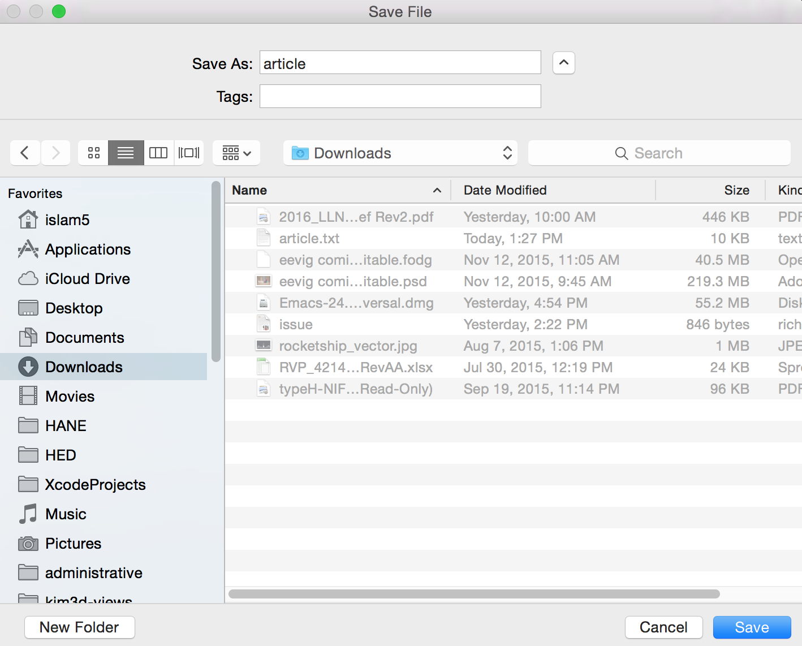

.. include:: urls.rst

Graphics Functionality
^^^^^^^^^^^^^^^^^^^^^^^^

This section describes the two graphical tools I have developed: ``gui`` matches a small subset of functionality that the Readability_ tool handles excellently; ``gui2`` is a PyQt4_ GUI front-end to the Readability_ API.

GUI: Media Website Text Formatter
------------------------------------

This GUI can read from the following media websites: `Lightspeed Magazine`_, Medium_, `The New Yorker`_, `The New York Times`_, and the `Virginia Quarterly Review`_. Here is a screenshot!

.. |gui_screenshot| image:: images/gui_screenshot.png
   :width: 100%
   :align: middle

==================================================================================================================================================================================== =
|gui_screenshot|
A screenshot of the GUI reader, converting the URL for the `The New York Times`_ into text. Note the separate icons above for the five media websites from which this GUI can read.
==================================================================================================================================================================================== =

The screenshots of the save file dialog and the print preview dialog are shown below.

.. |gui_screenshot_preview| image:: images/gui_screenshot_printpreview.png
   :width: 100%
   :align: middle

====================================== ===============================================
|gui_screenshot_save|                  |gui_screenshot_preview|
The GUI screenshot of the save dialog. The GUI screenshot of the print preview dialog.
====================================== ===============================================

.. note:: 
   I do not support or maintain this tool after I found out about Readability_.

GUI2: Readability GUI Front-End
----------------------------------

This is the PyQt4 GUI front-end to Readability_.

.. |gui2_screenshot_articlelist| image:: images/gui2_screenshot_articlelist.png
   :width: 100%
   :align: middle

.. |gui2_screenshot_articletext| image:: images/gui2_screenshot_articletext.png
   :width: 100%
   :align: middle

================================================================================================ ================================================================================================
|gui2_screenshot_articlelist|                                                                    |gui2_screenshot_articletext|
The list form of the article’s content, with working dialogs for ``Font`` and ``Print Preview``. The text form of the article’s content, with working dialogs for ``Font`` and ``Print Preview``. 
================================================================================================ ================================================================================================

A screenshot of the font changing dialog, the ``Font`` button, and a screenshot of the print preview dialog, the ``Print`` button, are shown below.

.. |gui2_screenshot_fontdialog| image:: images/gui2_screenshot_fontdialog.png
   :width: 100%
   :align: middle

.. |gui2_screenshot_printpreviewdialog| image:: images/gui2_screenshot_printpreviewdialog.png
   :width: 100%
   :align: middle

============================= =====================================================================================
|gui2_screenshot_fontdialog|  |gui2_screenshot_printpreviewdialog|
The ``Font`` button dialog.   The print preview dialog launched by the ``Print`` button in the article text widget.
============================= =====================================================================================

In the immediate future, I plan on at least implementing the following, all using the Readability_ API.

* ``EPUB`` button, to create the article in EPUB_ format.

* Adding and deleting articles through the article list widget.
