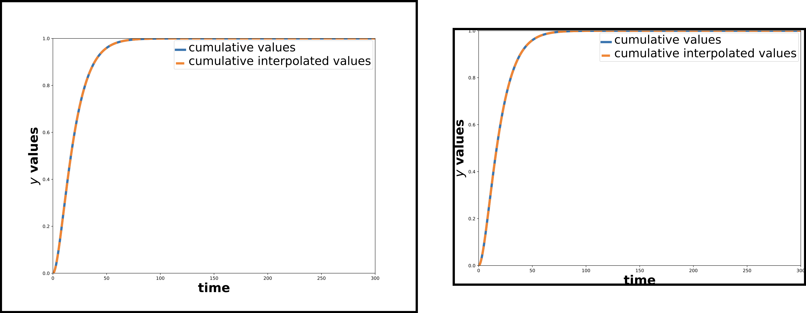

.. include:: urls.rst

.. _new_functionality_label:
	     
New Functionality
^^^^^^^^^^^^^^^^^^^
This consists of newer functionality that does not download NPR episodes, nor can one straightforwardly modify them to download NPR episodes.

.. _autoCropImage_label:

``autoCropImage``
==================
``autoCropImage`` automatically crops image (PNG_, JPEG_, TIFF_, etc.) and PDF_ files to remove whitespace. The default whitespace color is ``white``. The help screen for this command line tool is here,

.. code-block:: console

   usage: autoCropImage [-h] --input INPUT [--output OUTPUT] [--color COLOR] [--trans] [--newwidth NEWWIDTH] [--show]

   optional arguments:
     -h, --help           show this help message and exit
     --input INPUT        Name of the input file.
     --output OUTPUT      Name of the output file. Optional.
     --color COLOR        Name of the color over which to autocrop. Default is white.
     --trans              If chosen, also remove the transparency wrapping around the image. Works only for non-PDF images.
     --newwidth NEWWIDTH  New width of the image.
     --show               If chosen, then show the final image after cropped.

In the two examples shown here, I use only *white* (default) background. The first example, :numref:`fig_autocrop_png` demonstrates how this tool autocrops a PNG_ image file.

.. _fig_autocrop_png:

   On the left (with dark black borders) is the uncropped file, :download:`iwanttobelieve_uncropped.png <images/iwanttobelieve_uncropped.png>`, and on the right is the cropped-without-any-whitespace (with dark black borders) file, :download:`iwanttobelieve_cropped.png <images/iwanttobelieve_cropped.png>`.

You can generate :download:`iwanttobelieve_cropped.png <images/iwanttobelieve_cropped.png>` from :download:`iwanttobelieve_uncropped.png <images/iwanttobelieve_uncropped.png>` by running,

.. code-block:: console

   autoCropImage --input=iwanttobelieve_uncropped.png --output=iwanttobelieve_cropped.png

The second example, :numref:`fig_autocrop_pdf` demonstrates how this tool autocrops a PDF_ image file.

.. _fig_autocrop_pdf:

   On the left (with dark black borders) is the uncropped file, :download:`cumulative_plot_emission_uncropped.pdf <images/cumulative_plot_emission_uncropped.pdf>`, and on the right is the cropped-without-any-whitespace (with dark black borders) file, :download:`cumulative_plot_emission_cropped.pdf <images/cumulative_plot_emission_cropped.pdf>`.

You can generate :download:`cumulative_plot_emission_cropped.pdf <images/cumulative_plot_emission_cropped.pdf>` from :download:`cumulative_plot_emission_uncropped.pdf <images/cumulative_plot_emission_uncropped.pdf>` by running,

.. code-block:: console

   autoCropImage --input=cumulative_plot_emission_uncropped.pdf --output=cumulative_plot_emission_cropped.pdf

.. _convertImage_label:

``convertImage``
================
*Quite a long time ago*, ``convertImage`` used the `CloudConvert REST API`_ to *smoothly and without pain points* convert and resize SVG_ images to PNG_ images of the same base name. And no, I'm not going to `git bisect`_ my way to the commit when that last happened.

Now ``convertImage`` does five things, as seen when running ``convertImage -h``.

.. code-block:: console

   usage: convertImage [-h] [--noverify] [--info] {image,movie,youtube,aspected,fromimages} ...

   Now does five different things, where only "image" operates on image files!

   positional arguments:
     {image,movie,youtube,aspected,fromimages}
			   Choose whether to convert a video or an image
       image               If chosen, convert an SVG(Z), PDF, or PNG into PNG.
       movie               If chosen, convert an MP4 into an animated GIF.
       youtube             If chosen, convert a YOUTUBE video with URL into an animated GIF.
       aspected            If chosen, create an aspected MP4 file from an input MP4 file.
       fromimages          If chosen, then convert a sequence of PNG/JPEG/TIF images into an MP4 file.

   optional arguments:
     -h, --help            show this help message and exit
     --noverify            If chosen, do not verify the SSL connection.
     --info                If chosen, then print out INFO level logging.

There are two optional top-level flags.

* ``--info`` prints out :py:const:`INFO <logging.INFO>` level :py:mod:`logging` output.

* ``--noverify`` ignores verification of SSL transactions. It is optional and defaults to ``False``.

:ref:`convertImage image <convertImage_image>` *tries* to use the `CloudConvert REST API`_ to convert SVG_ or SVGZ_, PDF_, or PNG_ images to another PNG_ image. :ref:`convertImage movie <convertImage_movie>` creates an animated GIF_ file from an MP4_ file. :ref:`convertImage youtube <convertImage_youtube>` creates an animated GIF_ from a YouTube_ clip. Finally, :ref:`convertImage aspected <convertImage_aspected>` creates an *aspected* MP4_ file from an input MP4_ file.

:ref:`convertImage movie <convertImage_movie>`, :ref:`convertImage youtube <convertImage_youtube>`, and :ref:`convertImage fromimages <convertImage_fromimages>` use FFmpeg_ underneath the hood, using a :py:mod:`subprocess <subprocess.Popen>` that implements this `tutorial on high quality movie to animated GIF conversion <movie_2_gif_>`_.

.. note::

   A recent `Medium article`_ describes two ways to produce similarly high quality animated GIF_ files.

   * create the animated GIF_ from a frame-by-frame list of PNG_ files, such as those used to create the MP4_ file.
     
   * Use `Gifsicle <http://www.lcdf.org/gifsicle>`_ to optimize (make smaller but same quality) the initial animated GIF_ file.

   I have not yet implemented these improvements into NPRstuff.
   
.. _convertImage_image:

convertImage image
--------------------
``convertImage image`` *tries* to use the  `CloudConvert REST API`_ to convert SVG_ or SVGZ_, PDF_, or PNG_ images to another PNG_ image. Its help screen, when running ``convertImage image -h``, is,

.. code-block:: console

   usage: convertImage image [-h] -f filename [--width WIDTH] [-F {svg,pdf,png}]

   optional arguments:
     -h, --help            show this help message and exit
     -f filename, --filename filename
			   Name of the input image file.
     --width WIDTH         If defined, new width of the file. Optional
     -F {svg,pdf,png}, --format {svg,pdf,png}
			   Format of input file. Must be one of SVG/SVGZ, PDF, or PNG.

However, **it currently does not work**. When I run ``convertImage image`` on :download:`cumulative_plot_emission_cropped.pdf <images/cumulative_plot_emission_cropped.pdf>`, here is what I get,

.. code-block:: console

   bash$ convertImage image -f cumulative_plot_emission_cropped.pdf
   ERROR, CloudConvert sort of pooped the bed. This conversion functionality no longer works. Exiting...

Fortunately, pdftocairo_ can convert PDF_ to PNG_, and cairosvg_ can convert SVG_ and SVGZ_ to PNG_.
   
.. _convertImage_movie:

convertImage movie
--------------------
``convertImage movie`` converts an MP4_ file into an animated GIF_. Its help screen, when running ``convertImage movie -h``, is,

.. code-block:: console

   usage: convertImage movie [-h] -f filename [-s scale] [-d PARSER_MOVIE_DIRNAME]

   optional arguments:
     -h, --help            show this help message and exit
     -f filename, --filename filename
			   Name of the input video (MP4) file.
     -s scale, --scale scale
			   Multiply the width and height of the input MP4 file into the output GIF. Default is 1.0 (GIF file has same dimensions as input MP4 file).
			   Must be greater than 0.
     -d PARSER_MOVIE_DIRNAME, --dirname PARSER_MOVIE_DIRNAME
			   Optional argument. If defined, the directory into which to store the file.

The required flag is ``-f`` or ``--filename``, to specify the input MP4_ file. There are two optional flags.

* ``-s`` or ``--scale`` resizes the width and height of the input MP4_ file by some factor. Its default is 1.0, and it must be greater than zero.

* ``-d`` or ``--dirname`` specifies the directory into which to store the output animated GIF_. By default, it is the *same* directory as the MP4_ file.

For example, when we run ``convertImage movie`` on :download:`covid19_conus_LATEST.mp4 <images/covid19_conus_LATEST.mp4>` (2.6 MB in size) with a scale factor of 0.5 with this command,

.. code-block:: console

   convertImage movie -f covid19_conus_LATEST.mp4 -s 0.5

Then we get this animated GIF_ in :numref:`covid19_conus_LATEST_gif` (13M in size).

.. _covid19_conus_LATEST_gif:

.. figure:: images/covid19_conus_LATEST.gif
   :width: 100%
   :align: left

   The animated GIF_ of COVID-19 cumulative cases and deaths in the `CONUS <https://en.wikipedia.org/wiki/Contiguous_United_States>`_, as of 11 February 2021: nearly 27.1 million cases, and over 470k deaths.
   
.. _convertImage_youtube:

convertImage youtube
----------------------
``convertImage youtube`` converts a YouTube_ clip into an animated GIF_. It *first* creates an MP4_ file, and then converts that MP4_ file into an animated GIF_. Its help screen, when running ``convertImage youtube -h``, is,

.. code-block:: console

   usage: convertImage youtube [-h] -u url -o output [-q quality] [-d duration] [-s scale]

   optional arguments:
     -h, --help            show this help message and exit
     -u url, --url url     YouTube URL of the input video.
     -o output, --output output
			   Name of the output animated GIF file that will be created.
     -q quality, --quality quality
			   The quality of the YouTube clip to download. Only video portion is downloaded. May be one of highest, high, medium, low. Default is highest.
     -d duration, --duration duration
			   Optional argument. If chosen, the duration (in seconds, from beginning) of the video to be converted into an animated GIF.
     -s scale, --scale scale
			   Optional scaling of the input video. Default is 1.0.

The two required arguments are ``-u`` or ``--url`` (the YouTube_ URL of the input video), and ``-o`` or ``--output`` for the name of the output animated GIF_. There are three optional arguments,

* ``-q`` or ``--quality`` specifies the quality of the YouTube_ clip to download. May be one of ``highest``, ``high``, ``medium``, or ``low``. The default is ``highest``.

* ``-d`` or ``--duration`` specifies the duration (in seconds, from the beginning) of the video to convert into an animated GIF_. If you don't specify, then it will use the *whole* video.

* ``-s`` or ``--scale`` resizes the width and height of the intermediate MP4_ file by some number. Its default is 1.0, and it must be greater than zero.

So for example, we take this `fun clip from the Lucas Bros. Moving Co. <https://www.youtube.com/watch?v=R-pmYwr8zbU>`_, which we show below,

.. youtube:: R-pmYwr8zbU
   :width: 100%

And run this command,

.. code-block:: console

   convertImage youtube -u "https://www.youtube.com/watch?v=R-pmYwr8zbU" -o "lucas_bros.gif" -q highest -s 0.5

to generate a ``highest`` quality animated GIF_, scaled to *half* the original size of the YouTube_ clip, into :numref:`lucas_bros_gif` (17M in size).

.. _lucas_bros_gif:

.. figure:: images/lucas_bros.gif
   :width: 100%
   :align: left

   One of my favorite scenes from `Lucas Bros. Moving Co. S01E03: Before & After Models <https://www.imdb.com/title/tt3472130/?ref_=ttep_ep3>`_. I giggle each time I see it.

.. _convertImage_aspected:

convertImage aspected
-----------------------
``convertImage aspected`` *symmetrically letterboxes* a non-square input MP4_ file, so that the output MP4_ file is either *square*, or *9/16* aspect ratio (9 width units and 16 height units), or *16/9* aspect ratio (16 width units and 9 height units). This letterboxing color can be either *black* or *white*. If the input MP4_ file's *width is greater than the aspect ratio times height*, the output MP4_ file will have equal width padding on the top and bottom to get the correct aspect ratio. If the input MP4_ file's *width is smaller than the aspect ratio times height*, the output MP4_ file will have equal width padding on the left and right to get the correct aspect ratio.

Its help screen, when running ``convertImage aspected -h``, is,

.. code-block:: console

   usage: convertImage aspected [-h] -f filename -o OUTPUTFILENAME [-a {square,916,169}] [-b]

   optional arguments:
     -h, --help            show this help message and exit
     -f filename, --filename filename
			   Name of the input video (MP4) file.
     -o OUTPUTFILENAME, --output OUTPUTFILENAME
			   Name of the output MP4 video that will be square.
     -a {square,916,169}, --aspect {square,916,169}
			   The aspect ratio to choose for the final video. Can be one of three: "square" is 1:1, "916" is 9/16 (width 9 units, height 16 units), and
			   "169" is 16/9 (width 16 units, height 9 units). Default is "square".
     -b, --black           If chosen, then pad the sides OR the top and bottom with BLACK instead of WHITE. Default is to do WHITE.

``-f`` or ``--filename`` specifies the input MP4_ file. ``-o`` or ``--output`` specifies the output file name.

The aspect ratio is specified with the ``-a`` or ``--aspect`` flag. It can be either ``square`` (equal width and height), ``916`` (final width is 9/16 of height), or ``169`` (final width is 16/9 of height). The default aspect ratio is ``square``.

The letterboxing color is by default ``white``. However, the ``-b`` or ``--black`` flag sets the letterboxing color to be ``black``.

Here are two examples, for the default *square* aspect ratio and *white* letterboxing.

1. For an MP4_ file wider than it is high, this command,

   .. code-block:: console

      convertImage aspected -f covid19_conus_LATEST.mp4 -o covid19_conus_LATEST_square.mp4

   Converts :download:`covid19_conus_LATEST.mp4 <images/covid19_conus_LATEST.mp4>` into :download:`covid19_conus_LATEST_square.mp4 <images/covid19_conus_LATEST_square.mp4>`, which has black letterboxes on its top and bottom.

2. For an MP4_ file higher than it is wide, this command,

   .. code-block:: console

      convertImage aspected -f covid19_california_LATEST.mp4 -o covid19_california_LATEST_square.mp4

   Converts :download:`covid19_california_LATEST.mp4 <images/covid19_california_LATEST.mp4>` into :download:`covid19_california_LATEST_square.mp4 <images/covid19_california_LATEST_square.mp4>`, which has black letterboxes on its left and right.

.. _convertImage_fromimages:

convertImage fromimages
------------------------
``convertImatge fromuimages`` creates an MP4_ movie file from a collection of image files as frames. Say the files live in a directory ``dirname``, the prefix of the image files is ``PREFIX``, and the suffix of the image files is ``png`` so that the PNG_ images are named, say, ``PREFIX0000.png`` sequentially to ``PREFIX0401.png``. This command will create an MP4_ file, named ``PREFIX.mp4``, in ``dirname``.

Its help screen, when running ``convertImage fromimages -h``, is,

.. code-block:: console

   usage: convertImage fromimages [-h] [-d dirname] -p prefix [-s suffix] [-f fps] [--autocrop]

   optional arguments:
     -h, --help            show this help message and exit
     -d dirname, --dirname dirname
			   The name of the directory to look for a sequence of PNG/JPEG/TIF images. Default is <CURRENT_DIRECTORY>.
     -p prefix, --prefix prefix
			   The prefix of PNG/JPEG/TIF files through which to go.
     -s suffix, --imagesuffix suffix
			   The suffix of the image files. Default is png.
     -f fps, --fps fps     The number of frames per second in the MP4 file. Default is 5.
     --autocrop            If chosen, then perform an autocrop, and then (where necessary) resize each image so that their widths and heights are multiples of 2.

Here are the command line arguments.
			   
* ``-d`` or ``--dirname`` specifies the directory where the image files live. By default it is the current working directory.

* ``-p`` or ``--prefix`` is the prefix to the collection of image files as frames.
  
* ``-s`` or ``--imagesuffix`` is the suffix of the image files. By default it is ``png``, but could be anything that ffmpeg_ can read.

* ``-f`` or ``--fps`` is the frames per second for the output MP4_ file. The default is 5, but it must be :math:`\ge 1`.

* ``--autocrop`` specifies whether you want to automatically crop out white space from the image files.

``<CURRENT_DIRECTORY>`` refers to the current working directory in which ``convertImage fromImages`` has been launched.
			   
.. _changedates_label:

``changedates``
================
``changedates`` changes the creation date of JPEG_ and MOV_ files, that my Canon digital camera creates, by up and down one year. I created this tool because my Canon digital camera does not set the right year on the creation date for image files it creates. This caused problems when I uploaded those images to `Google Picasa <https://picasaweb.google.com/home>`__ or `Google+ <https://plus.google.com/>`__. The help screen for this command line tool is here,

.. code-block:: console

   usage: changedates [-h] --dirname DIRNAME [--movs] [--minus]

   optional arguments:
     -h, --help         show this help message and exit
     --dirname DIRNAME  Name of the directory to look for jpeg files.
     --movs             If chosen, process MOV files instead.
     --minus            If chosen, subtract a year from the files.

.. _music_to_m4a_label:
     
``music_to_m4a``
=================
``music_to_m4a`` can convert a single file from MP3_, OGG_, or FLAC_ format to M4A_ format while preserving music file metadata, and can optionally set the total number of album tracks and the album cover if the music files is in an album. It can also rename an m4a music file into the format “*artist name* - *song name*.m4a.” The help screen for this command line tool is here,

.. code-block:: console

   usage: music_to_m4a [-h] --inputfile INPUTFILE [--outfile OUTFILE] [--tottracks TOTTRACKS] [--albumloc ALBUMLOC] [--quiet] [--rename] [--notitle]

   optional arguments:
     -h, --help            show this help message and exit
     --inputfile INPUTFILE
			   Name of the input audio file to convert.
     --outfile OUTFILE     Optional name of the output file.
     --tottracks TOTTRACKS
			   Optional total number of tracks in album of which song is a part.
     --albumloc ALBUMLOC   Optional path to location of the album cover image file. Must be in JPEG or PNG.
     --quiet               If chosen, then verbosely print output of processing.
     --rename              If chosen, simply rename the m4a file to the form <artist>.<song title>.m4a
     --notitle             If chosen, do not use titlecase functionality to fix the titles of songs.

.. _download_surahs_label:
     
``download_surahs``
====================
``download_surahs`` downloads recorded surahs (`Abdur-Rashid Sufi`_) to a directory of your choice. The help screen for this command line tool is here,

.. code-block:: console

   usage: download_surahs [-h] [--outdir OUTDIR]

   optional arguments:
     -h, --help       show this help message and exit
     --outdir OUTDIR  Directory to put this data into. Default is /mnt/software/sources/pythonics/nprstuff.

``myrst2html``
=================
``myrst2html`` acts *almost* like rst2html_ in default mode, except instead of using (for LaTeX math formulae) the ``math.css`` default it uses MathJax_ with the correct CDN_, which in this case is https://cdn.mathjax.org/mathjax/latest/MathJax.js?config=TeX-AMS-MML_HTMLorMML. I borrow shamelessly from `this GitHub gist`_ with some slight modifications.

One uses it *just* like default rst2html_,

.. code-block:: console

   myrst2html filename.rst > filename.html

This generates the HTML file, ``filename.html``, from the RST markup file, ``filename.rst``, but now with MathJax_.
   
.. _rst2html: https://manpages.debian.org/testing/docutils-common/rst2html.1.en.html
.. _MathJax: https://www.mathjax.org/
.. _CDN: https://en.wikipedia.org/wiki/Content_delivery_network
.. _`this GitHub gist`: https://gist.github.com/Matherunner/c0397ae11cc72f2f35ae
.. _PNG: https://en.wikipedia.org/wiki/Portable_Network_Graphics
.. _PDF: https://en.wikipedia.org/wiki/PDF
.. _`git bisect`: https://git-scm.com/docs/git-bisect
.. _GIF: https://en.wikipedia.org/wiki/GIF
.. _YouTube: https://www.youtube.com
.. _FFmpeg: https://ffmpeg.org
.. _movie_2_gif: http://blog.pkh.me/p/21-high-quality-gif-with-ffmpeg.html
.. _SVG: https://en.wikipedia.org/wiki/Scalable_Vector_Graphics
.. _SVGZ: https://en.wikipedia.org/wiki/Scalable_Vector_Graphics#Compression
.. _pdftocairo: http://manpages.ubuntu.com/manpages/trusty/man1/pdftocairo.1.html
.. _cairosvg: http://manpages.ubuntu.com/manpages/focal/en/man1/cairosvg.1.html
.. _MP4: https://en.wikipedia.org/wiki/MPEG-4_Part_14
.. _`Medium article`: https://medium.com/@Peter_UXer/small-sized-and-beautiful-gifs-with-ffmpeg-25c5082ed733
